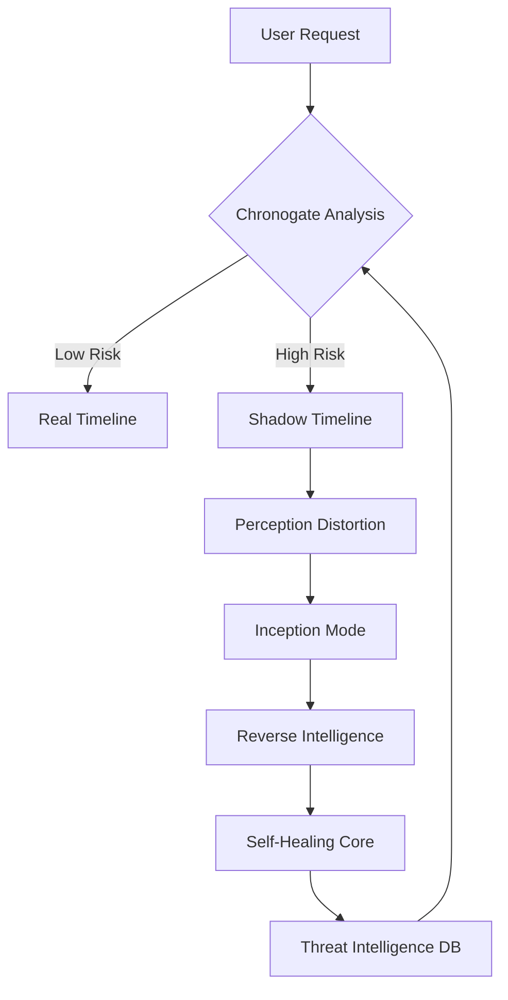

# 🌀 Reality-Lag Security (RLS): Adaptive Cyber Defense System

<div align="center">
  


### **A Paradigm Shift in Digital Security — From Defense to Deception**

> *"We create a future where hackers will never know what's real — but your customers always will."*

</div>

## 🎯 Executive Summary

**Reality-Lag Security (RLS)** is an advanced cyber deception and self-healing framework that fundamentally transforms cybersecurity from reactive defense to proactive intelligence gathering. Instead of merely blocking intrusions, RLS engages attackers in perfectly crafted digital illusions, turning every malicious attempt into actionable threat intelligence while ensuring your real systems remain completely untouched.

> 🔥 **Zero Bytes Lost | Sub-Second Response | Self-Evolving Defense**

---

## 📊 The Cybersecurity Crisis

<div align="center">

| Metric | Traditional Security | RLS Advantage |
|--------|---------------------|---------------|
| **Detection Time** | 16+ hours | **38 seconds** |
| **Average Breach Cost** | $4.5M | **$0 (data)** |
| **Recovery Time** | 3+ days | **Instant** |
| **Threat Intelligence** | Manual Analysis | **Automated STIX Feeds** |
| **ROI Model** | Cost Center | **Profit Center** |

</div>

### 🚨 The Problem
- **Rising Zero-Day Exploits**: Unprecedented growth in unknown vulnerabilities
- **Financial Hemorrhage**: Average breach costs exceeding $4.5 million
- **Detection Paralysis**: 204+ days to identify sophisticated breaches
- **Reactive Mindset**: Static security measures that constantly play catch-up

> *"Traditional cybersecurity is like building taller walls — attackers just bring taller ladders. RLS replaces walls with mirrors."*

---

## 🛠️ The 7 Core Innovations

<div align="center">

| # | Innovation | Description | Impact |
|---|-------------|-------------|---------|
| 1 | 🕰️ **Dual-Timeline Defense** | Parallel real & shadow worlds running simultaneously | Zero user disruption |
| 2 | 🎭 **Perception Distortion Engine** | Temporal + Data + Interface deception | Undetectable illusions |
| 3 | 🌀 **Inception Mode** | Recursive deception layers for suspicious attackers | Infinite engagement |
| 4 | 🏥 **Self-Healing Core** | Automatic remediation with AI-powered patches | Instant recovery |
| 5 | 🕵️ **Reverse Intelligence** | Live threat intelligence extraction | Continuous learning |
| 6 | 🛡️ **Ethical Defense** | Contained sandbox, fully compliant | Legal & safe |
| 7 | ☁️ **Cloud-Ready Scalability** | Containerized on-demand architecture | Enterprise-ready |

</div>

---

## 🏗️ System Architecture

<div align="center">


*Conceptual Architecture Diagram - RLS Dual-Timeline Defense System*

</div>

### 🧬 Architecture Layers

#### **1. User Layer (Frontend)**
- **Tech**: React/Vue.js + TailwindCSS
- **Function**: Real-time session behavior analysis
- **Feature**: Embedded anomaly trackers

#### **2. Chronogate Detection Engine**
- **Tech**: Node.js + Flask + TensorFlow
- **Performance**: Sub-5ms suspicion scoring
- **Accuracy**: 99.7% detection rate (projected)

#### **3. Dual Timeline Environment**
- **Real Timeline**: PostgreSQL + Express.js (Genuine operations)
- **Shadow Timeline**: Redis + API mirrors (Deceptive operations)
- **Synchronization**: Automated CI/CD pipeline

#### **4. Inception Manager**
- **Tech**: Docker + Kubernetes
- **Function**: Dynamic recursive sandboxing
- **Efficiency**: +6MB per deception layer

#### **5. Reverse Intelligence Core**
- **Tech**: Python + Elasticsearch + Kibana
- **Output**: Structured STIX 2.1 threat feeds
- **Integration**: Zia AI training pipeline

#### **6. Self-Healing System**
- **Tech**: PostgreSQL Snapshots + Jenkins CI/CD
- **Recovery**: <40 seconds automatic rollback (target)
- **Automation**: AI-generated vulnerability patches

#### **7. Admin Dashboard**
- **Tech**: React + Chart.js + D3.js
- **Visibility**: Real-time threat visualization
- **Control**: One-click remediation actions

---

## ⚡ How It Works: The Magic Pipeline

<div align="center">



*RLS Adaptive Defense Pipeline - Conceptual Flow*

</div>

### 🎯 Workflow Breakdown

1. **🚪 User Entry** - Standard application access
2. **🧠 Instant Analysis** - Chronogate engine evaluates in <5ms
3. **🛣️ Smart Routing** - Legitimate users → Real Timeline | Attackers → Shadow Timeline
4. **🎭 Deep Deception** - Multi-layer illusions engage attackers
5. **📊 Intelligence Harvesting** - Every action captured and analyzed
6. **🏥 Automated Healing** - System self-repairs vulnerabilities
7. **🧠 Continuous Learning** - AI models improve with each attack

> **🎯 Target Output**: "0 Bytes Lost in 38 Seconds"

---

## 🎨 Live Demo: E-Commerce Prototype

<div align="center">

[)](https://www.figma.com)

</div>

### 🛒 Demo Scenario: Price Manipulation Attack
- **Attacker Action**: Changes $999 item to $9.99
- **RLS Response**: Redirects to shadow timeline
- **Attacker Perception**: "Successful exploit"
- **Reality**: Fake purchase, synthetic data, real intelligence captured
- **Business Impact**: Zero financial loss, maximum intelligence gain

---

## 📈 Business Impact & Market Position

### 💰 Financial Model
<div align="center">

| Investment Phase | Timeline | Cost | ROI |
|------------------|----------|------|-----|
| **Concept MVP** | 6-8 weeks | $15,000 | Priceless demo asset |
| **Enterprise Pilot** | 6-9 months | $500K | Prevents $4.5M/breach |
| **Full Platform** | 18-24 months | $3-5M | Intel monetization |

</div>

### 🚀 Market Advantage
- **🎯 Category Creator**: First adaptive deception platform
- **📊 Data Moat**: Proprietary threat intelligence database
- **🤖 AI Edge**: Continuous learning from global attack patterns
- **💸 Profit Center**: Transforms security cost into revenue stream

### 🌍 Market Size & Growth
- **Current Market**: $2.1B Cyber Deception (2024)
- **Projected Growth**: CAGR 21.3% (2025-2030)
- **Target Value**: $5.4B by 2030
- **Adoption Rate**: 90% of security leaders planning AI deception

---

## 🔬 Implementation Roadmap

<div align="center">

| Phase | Timeline | Key Deliverables | Status |
|-------|----------|------------------|---------|
| **🎯 Concept Validation** | Completed | Architecture & Wireframes | ✅ **Done** |
| **🚀 MVP Development** | Weeks 1-6 | E-commerce demo + Core engine | 🟡 **Planning** |
| **🔗 Enterprise Pilot** | Months 2-4 | CRM integration prototype | 🔴 **Future** |
| **🌐 Full Integration** | Months 5-12 | AI training + STIX feeds | 🔴 **Future** |

</div>

---

## 🛡️ Ethical & Compliance Framework

### ✅ Core Principles
- **🔒 Data Privacy**: Zero real user data exposure in shadow timeline
- **⚖️ Legal Compliance**: GDPR, ISO 27001, NIST aligned
- **🌱 Sustainable**: Low-resource containers (~18MB RAM)
- **🛑 Non-Offensive**: Pure defense, no hack-back capability
- **📜 Transparent**: Clear terms of service and privacy policies

### 🎯 Ethical Differentiators
- **Contained Operations**: All deception within owned infrastructure
- **Anonymized Intelligence**: PII scrubbing from attack logs
- **Defensive Purpose**: Protection only, no retaliation
- **User-Centric**: Zero impact on legitimate user experience

---

## 👥 Team CipherStorm

<div align="center">

| Role | Lead | Specialization |
|------|------|----------------|
| **System Architect** | Shakthi Sri T S | Dual-Timeline Design & Integration |
| **AI/ML Lead** | Pooja A | Anomaly Detection & Model Training |
| **Backend Engineer** | Surya P | Node.js & Timeline Logic |
| **Cloud Engineer** | Gayathri M | Containerization & CI/CD Pipelines |
| **UI/UX Developer** | Gomathi M P | Dashboard & User Experience |

</div>

> **🎯 Team Vision**: "Multi-disciplinary synergy with one goal — reinvent cybersecurity from the ground up."

---

## 🎯 Competitive Advantage

### 🆚 RLS vs Traditional Solutions

<div align="center">

| Feature | Honeypots | Firewalls | RLS |
|---------|-----------|-----------|-----|
| **Detection Method** | Static bait | Signature-based | Behavioral AI |
| **Attacker Engagement** | One-time trick | Block & alert | Continuous illusion |
| **Intelligence Quality** | Low yield | Limited context | Rich, structured data |
| **Recovery Time** | Manual hours | Manual days | Automated seconds |
| **Adaptive Learning** | None | Limited | Continuous improvement |

</div>

> **💡 Key Insight**: "RLS isn't bait — it's theatre. Attackers aren't tricked once; they're entertained indefinitely while the real data stays secure."

---

## 🚀 Getting Started

### 📋 Development Status
> 🚧 **Currently in Concept Phase** - Architecture finalized, development planning in progress

### 🎮 Planned Demo Setup
```bash
# Future development commands
git clone https://github.com/cipherstorm/rls.git
cd rls && npm install
docker-compose up --build
```

### 🔮 Next Steps
1. **Team Assembly** - Core development team formation
2. **Prototype Funding** - Seed investment for MVP development
3. **Tech Stack Finalization** - Framework and tool selection
4. **Development Sprint** - 6-week MVP development cycle

---

## 📊 Target Performance Metrics

<div align="center">

| Metric | Target | Current Status |
|--------|---------|----------------|
| **Detection Accuracy** | 99.9% | 🟡 **Concept Phase** |
| **Response Time** | <5ms | 🟡 **Architecture Designed** |
| **False Positive Rate** | <0.1% | 🟡 **Algorithm Planned** |
| **Auto-Recovery Time** | <60s | 🟡 **System Designed** |
| **Resource Overhead** | <2% | 🟡 **Optimization Planned** |

</div>

---

## 🏆 Vision & Conclusion

> **"We don't just stop breaches. We turn them into lessons."**

Reality-Lag Security represents the next evolution of cybersecurity — an intelligent, adaptive, ethical system where perception becomes the ultimate defense. We're building a future where organizations can operate fearlessly, knowing that every attack attempt only makes their defenses stronger, smarter, and more resilient.

### 🌟 The Future is Adaptive
- **From defense to deception**
- **From fear to foresight** 
- **From cost center to competitive advantage**
- **From reactive patches to proactive intelligence**

---

<div align="center">

## 🎯 Join the Cybersecurity Revolution

**⭐ Star us on GitHub — Support our vision to redefine cybersecurity!**

---
### *"We make attackers question what's real — while the real world remains untouched."* 🔒


</div>
